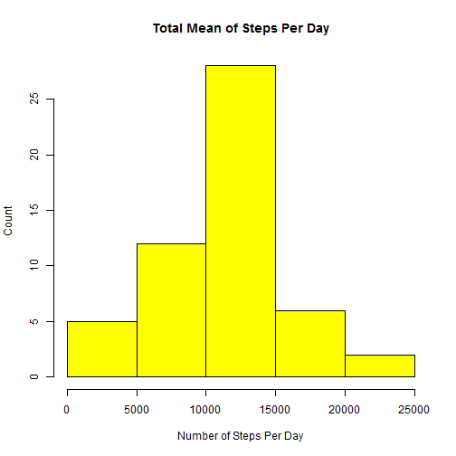
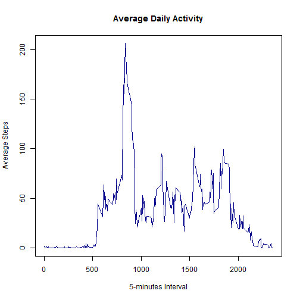
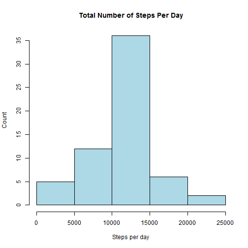
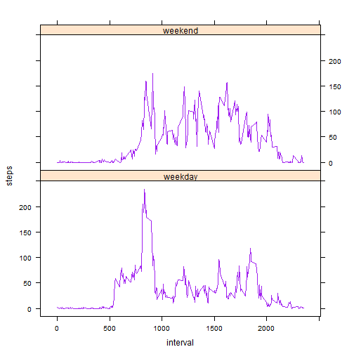

# Reproducible Research: Peer Assessment 1


## Loading and preprocessing the data

```r
activity <- read.csv("activity.csv", sep = ",", header = TRUE, na.string = "NA")
act_noNA <- activity[which(activity$step != "NA"), ]
str(activity)
```

```
## 'data.frame':	17568 obs. of  3 variables:
##  $ steps   : int  NA NA NA NA NA NA NA NA NA NA ...
##  $ date    : Factor w/ 61 levels "2012-10-01","2012-10-02",..: 1 1 1 1 1 1 1 1 1 1 ...
##  $ interval: int  0 5 10 15 20 25 30 35 40 45 ...
```


## What is mean total number of steps taken per day?
 - Check if "plyr" package is installed, if not install "plyr" package.

```r
if (!require("plyr")) install.packages("plyr")
```

```
## Loading required package: plyr
```

```r
library(plyr)

num_steps <- ddply(act_noNA, .(date), summarise, steps = sum(steps))
hist(num_steps$steps, col = "yellow", main = "Total Mean of Steps Per Day", 
    xlab = "Number of Steps Per Day", ylab = "Count")
```

 


## What is the mean and mediam number of steps taken per day?

```r
# mean of the steps
mean(num_steps$steps)
```

```
## [1] 10766
```

```r

# median of the steps
median(num_steps$steps)
```

```
## [1] 10765
```


## What is the average daily activity pattern?


```r
avg_steps <- ddply(act_noNA, .(interval), summarise, steps = mean(steps))
plot(avg_steps$interval, avg_steps$steps, type = "l", main = "Average Daily Activity", 
    xlab = "5-minutes Interval", ylab = "Average Steps", col = "darkblue")
```

 


 - The 5-minute interval, on average across all the days in the dataset, contains the maximum number of steps?


```r
max_steps <- which.max(avg_steps$steps)
max_interval <- avg_steps[max_steps, ]$interval
max_interval
```

```
## [1] 835
```

    
    
    

## Imputing missing values
 - Calculate and report the total number of missing values in the dataset (i.e. the total number of rows with NAs)

```r
sum(is.na(activity$steps))
```

```
## [1] 2304
```


-  Fill missing values in the dataset with the mean steps from 5-minutes interval.


```r
input.steps <- function(x) replace(x, is.na(x), mean(x, na.rm = TRUE))
steps_replc <- ddply(activity, ~interval, transform, steps = input.steps(steps))
```


 - the new dataset 

```r
new_inputed <- ddply(steps_replc, .(date), summarise, total_steps = sum(steps, 
    na.rm = TRUE))
head(new_inputed)
```

```
##         date total_steps
## 1 2012-10-01       10766
## 2 2012-10-02         126
## 3 2012-10-03       11352
## 4 2012-10-04       12116
## 5 2012-10-05       13294
## 6 2012-10-06       15420
```


- Make a histogram of the total number of steps taken each day and Calculate and 
report the mean and median total number of steps taken per day. 

 

```r
hist(new_inputed$total_steps, main = "Total Number of Steps Per Day", col = "lightblue", 
    xlab = "Steps per day", ylab = "Count")
```

 

```r

# mean steps per day (with imputed values)
mean(new_inputed$total_steps)
```

```
## [1] 10766
```

```r


# median steps per day (with imputed values)
median(new_inputed$total_steps)
```

```
## [1] 10766
```

 - Do these values differ from the estimates from the first part of the assignment? What is the impact of imputing missing data on the estimates of the total daily number of steps?
 
  Answer:  There is no change to the mean values.  However,there is a slight change to the new median.  It's one number higher than the old median value.

## Are there differences in activity patterns between weekdays and weekends?
   Check if "lattice" package is installed, if not install "lattice" package

```r
if (!require("lattice")) install.packages("lattice")
```

```
## Loading required package: lattice
```

```r
library(lattice)
```


```r
weekdays <- weekdays(as.Date(act_noNA$date))
data_weekdays <- transform(act_noNA, day = weekdays)
data_weekdays$wk <- ifelse(data_weekdays$day %in% c("Saturday", "Sunday"), "weekend", 
    "weekday")
average_week <- ddply(data_weekdays, .(interval, wk), summarise, steps = mean(steps))

xyplot(steps ~ interval | wk, data = average_week, layout = c(1, 2), type = "l", 
    col = "purple")
```

 


